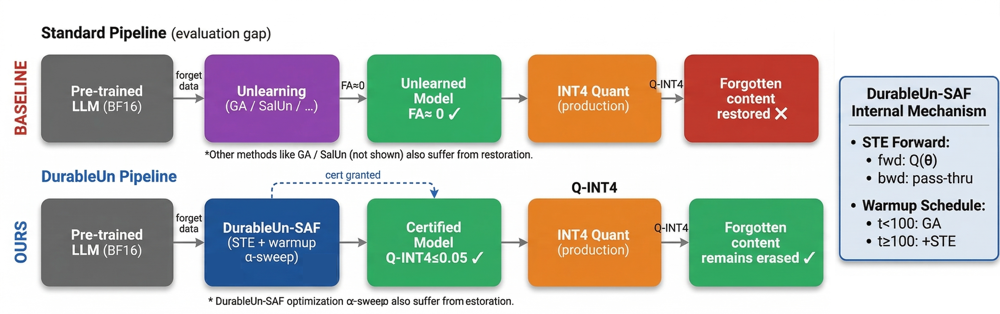
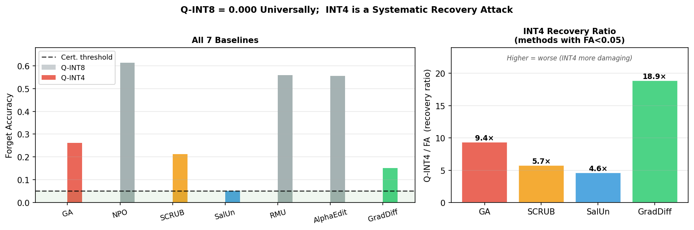
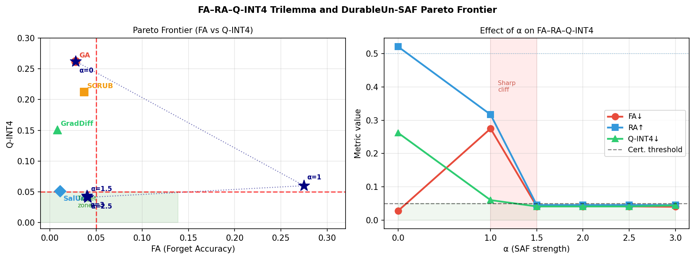
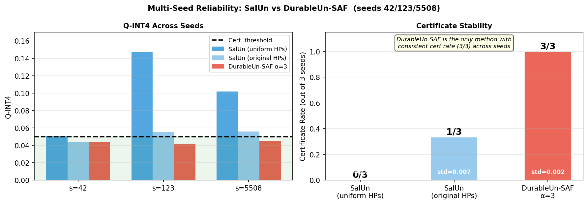

# DurableUn: INT4 Quantization as a Recovery Attack on Machine Unlearning

[](https://neurips.cc/2026)
[](https://arxiv.org/abs/XXXX.XXXXX)
[](LICENSE)
[](https://www.python.org/)
[](https://pytorch.org/)
[](https://www.nvidia.com/)

---

## TL;DR

> Every machine unlearning paper evaluates at BF16 precision.
> Every production LLM is deployed at INT4.
> **INT4 quantization silently restores forgotten content by 5–22× across all 7 state-of-the-art methods.**
> We introduce `DurableUn-SAF` — the first method with a stable empirical INT4 durability certificate: **cert rate = 3/3 seeds, Q-INT4 = 0.043 ± 0.002**.

---

## Core Problem

<p align="center">
  
</p>

**Standard pipeline (top):** A model is unlearned at BF16 (FA ≈ 0 ✓), then deployed at INT4. Forgotten content is restored — the GDPR compliance guarantee is silently broken.

**DurableUn pipeline (bottom):** Our STE-based quantization-aware training produces a model certified at BF16, INT8, *and* INT4 simultaneously.

---

## The INT4 Recovery Attack

<p align="center">
  
</p>

**Left:** Q-INT8 = 0.000 (grey bars) across **all 7 methods** — INT8 is completely harmless.
**Right:** INT4 recovery ratio (Q-INT4 / FA). GradDiff achieves the **best forgetting quality** (FA = 0.008) yet has the **worst INT4 recovery** (18.9×). State-of-the-art forgetting does not imply quantization robustness.

Key observation: **RA-INT4 ≈ RA** for all baselines. INT4 *selectively* re-exposes forgotten content without degrading general capability. This is a targeted recovery, not indiscriminate degradation.

| Finding | Result |
|---------|--------|
| **INT8 harmless** | Q-INT8 = 0.000 across 7 methods, 3 seeds, 2 architectures |
| **INT4 systematic attack** | 5–22× recovery in every method that successfully unlearned |
| **Best forgetter ≠ most robust** | GradDiff: FA = 0.008, Q-INT4 = 0.151 (18.9× recovery) |
| **Selective recovery** | RA-INT4 ≈ RA — INT4 is targeted, not indiscriminate |
| **Architecture-agnostic** | GA on Mistral-7B: Q-INT4 = 0.392 (stronger than on LLaMA) |

---

## The FA–RA–Q-INT4 Trilemma

<p align="center">
  
</p>

**Left:** Pareto frontier. Stars = DurableUn-SAF; shapes = baselines. Only DurableUn-SAF reaches the green target region (FA ≤ 0.05 **and** Q-INT4 ≤ 0.05).

**Right:** Dense sweep α ∈ {0, 1, 1.5, 2, 2.5, 3} reveals a **sharp structural phase transition** between α = 1 and α = 1.5. Once quantization pressure is sufficient for robustness, Q-INT4 drops below 0.05 but RA collapses to ≈ 0.045 and **stays there regardless of further tuning**. This is structural, not a tuning artifact.

> **Empirical conjecture (verified across 7 methods × 3 seeds × 2 HP settings):** No configuration simultaneously satisfies FA ≤ 0.05, RA ≥ 0.50, and Q-INT4 ≤ 0.05.

---

## Multi-Seed Certificate Stability

<p align="center">
  
</p>

| Method | FA (mean±std) | RA (mean±std) | Q-INT4 (mean±std) | Cert rate |
|--------|--------------|--------------|-------------------|-----------|
| SalUn (uniform HPs) | 0.009 ± 0.002 | 0.519 ± 0.036 | 0.100 ± 0.049 | 0/3 |
| SalUn (original HPs, lr=1e-4, 500 steps) | 0.033 ± 0.018 | 0.581 ± 0.021 | 0.052 ± 0.007 | 1/3 |
| **DurableUn-SAF α=3 (ours)** | 0.043 ± 0.002 | 0.046 ± 0.002 | **0.043 ± 0.002** | **3/3** |

SalUn's seed-42 result (Q-INT4 = 0.051) was an **optimistic outlier**. At its own published hyperparameters it fails 2 out of 3 seeds. DurableUn-SAF achieves cert 3/3 with 25× lower variance.

---

## Full Results Table

| Method | FA↓ | RA↑ | MIA | Q-INT8↓ | Q-INT4↓ | RA-INT4↑ | Cert. |
|--------|-----|-----|-----|---------|---------|----------|-------|
| GA | 0.028 | 0.521 | 0.000 | **0.000** | 0.262 | 0.540 | ✗ |
| NPO† | 0.636 | 0.624 | 0.494 | **0.000** | 0.613 | 0.622 | ✗ |
| SCRUB | 0.037 | 0.526 | 0.000 | **0.000** | 0.212 | 0.524 | ✗ |
| SalUn | **0.011** | **0.541** | 0.000 | **0.000** | 0.051 | **0.521** | ✗ |
| RMU† | 0.580 | 0.565 | 0.389 | **0.000** | 0.559 | 0.564 | ✗ |
| AlphaEdit† | 0.575 | 0.558 | 0.406 | **0.000** | 0.555 | 0.558 | ✗ |
| GradDiff | **0.008** | 0.510 | 0.000 | **0.000** | 0.151 | 0.538 | ✗ |
| **DurableUn-SAF α=3** | 0.040 | 0.045 | 0.000 | **0.000** | **0.044** | 0.047 | **✓** |

†: Method never achieved meaningful unlearning (FA >> 0.05).
Pre-unlearning MIA-AUC = 0.712; values near 0.0 post-unlearning indicate successful forgetting.

---

## Method

DurableUn-SAF augments gradient ascent with a Straight-Through Estimator (STE) quantization-aware objective:

```
L_SAF(θ) = −L_forget(θ)                      [Standard GA]
           − α(t) · L_forget(Q_STE(θ))         [Quantization-aware term]
           + λ · L_retain(θ)                    [Retain preservation]

Warmup:  α(t) = min(α_max, 2·α_max·(t−100)/(300−100)) · 1[t>100]
Balance: λ = max(1, α+1)
```

**Why full-model STE is necessary:** INT4 recovery is stored in base model weights (4.5B params), not just LoRA adapters (14M). LoRA-only STE gives Q-INT4 = 0.169 — insufficient for the certificate.

**Connection to SAM:** Related to Sharpness-Aware Minimization (Foret et al. 2021) but applied to the *forgetting* landscape. SAF maximises L_forget(Q_STE(θ)), which implicitly minimises the certificate slack κ·δ where κ = ‖∇L_forget(θ*)‖₂.

---

## Quickstart

```bash
git clone https://github.com/[anonymous]/DurableUn.git
cd DurableUn
pip install -r requirements.txt
```

Edit `hf_token.py` with your HuggingFace token (required for LLaMA-3 gated access):
```python
HF_TOKEN = "hf_PASTE_YOUR_TOKEN_HERE"
```

**Reproduce all paper tables:**

```bash
# Table 1 — baselines
py run.py baseline --datasets tofu --methods ga npo scrub salun rmu alpha_edit graddiff

# Table 2 — Pareto sweep
py -m experiments.revision_alpha_sweep --skip_salun

# Table 3 — multi-seed
py -m experiments.revision_multiseed

# Table 4 — SalUn original HPs (baseline tuning analysis)
py -m experiments.revision_alpha_sweep --skip_saf

# Table 5 — Mistral-7B architecture validation
py -m experiments.revision_second_arch --methods ga

# Appendix D — real bitsandbytes PTQ
py -m experiments.revision_realquant_eval

# Certificate
py run.py certificate --checkpoint checkpoints/saf_alpha3p0_tofu_s42
```

**Sanity check (~20 min):**
```bash
python experiments/phase0_baseline_audit.py --config configs/quick_config.yaml
```

**From pre-computed results (no GPU):**
```bash
python benchmark/summarise_results.py --results-dir results/
```

---

## Repository Structure

```
DurableUn/
├── run.py                          ← Master script
├── STEPS.md                        ← Step-by-step guide
├── REPRODUCE.md                    ← Exact commands for every paper number
├── DATASHEET.md                    ← Dataset documentation
├── CITATION.cff                    ← Machine-readable citation
├── croissant_metadata.json         ← NeurIPS Croissant metadata (RAI fields)
├── compute_certificate.py
├── requirements.txt
│
├── configs/
│   ├── base_config.yaml
│   ├── durableun_config.yaml
│   └── quick_config.yaml
│
├── src/
│   ├── baselines/                  ← GA, NPO, SCRUB, SalUn, RMU, AlphaEdit, GradDiff
│   ├── durableun/saf.py            ← DurableUn-SAF v4 (full-model STE)
│   ├── data/                       ← TOFU, MUSE-News, WikiBio WPU loaders
│   ├── evaluation/                 ← FA, RA, Q-INTk, MIA-AUC, RA-INT4
│   └── models/model_utils.py       ← NF4 + LoRA loader
│
├── experiments/
│   ├── revision_alpha_sweep.py     ← Dense Pareto sweep + SalUn orig. HPs
│   ├── revision_multiseed.py       ← Multi-seed SAF + SalUn
│   ├── revision_realquant_eval.py  ← Real bitsandbytes PTQ
│   └── revision_second_arch.py     ← Mistral-7B validation
│
├── figures/
│   ├── fig1_overview.png
│   ├── fig2_attack.png
│   ├── fig3_trilemma.png
│   └── fig4_multiseed.png
│
├── results/                        ← All experiment CSVs
└── paper/
    ├── neurips2026_durableun.tex
    └── durableun.bib
```

---

## Runtime Reference (RTX 4090)

| Method | Steps | Runtime | Peak VRAM |
|--------|-------|---------|-----------|
| Task Vector / DARE | — | < 1 min | 18.97 GB |
| AlphaEdit | 300 | 3 min | 18.97 GB |
| GA | 300 | 8 min | 11.20 GB |
| GradDiff | 300 | 12 min | 18.97 GB |
| SalUn (uniform) | 300 | 20 min | 22.57 GB |
| NPO / SCRUB | 300 | 22 min | 18.97 GB |
| SalUn (original HPs) | 500 | 35 min | 22.57 GB |
| **DurableUn-SAF α=1** | 300 | **9 min** | 19.02 GB |
| **DurableUn-SAF α=3** | 300 | **37 min** | 19.02 GB |
| RMU | 300 | ~658 min | 18.97 GB |

---

## Dataset and Croissant RAI Metadata

This repository contains **model evaluation scores** from running unlearning experiments on [TOFU](https://huggingface.co/datasets/locuslab/TOFU) (MIT). It does not contain human-annotated data.

Full Croissant metadata: [`croissant_metadata.json`](croissant_metadata.json)

```json
"annotationsPerItem":    "N/A — benchmark contains model evaluation scores, not human annotations.",
"annotatorDemographics": "N/A — benchmark contains model evaluation scores, not human annotations."
```

See [`DATASHEET.md`](DATASHEET.md) for dataset documentation following Gebru et al. (2021).

---

## Citation

```bibtex
@inproceedings{durableun2026,
  title     = {DurableUn: {INT4} Quantization as a Recovery Attack on Machine Unlearning,
               the {FA--RA--Robustness} Trilemma, and Sharpness-Aware Forgetting},
  author    = {Anonymous},
  booktitle = {Advances in Neural Information Processing Systems},
  year      = {2026}
}
```

---

## License

MIT — see [LICENSE](LICENSE).
LLaMA-3: [Meta Llama 3 Community License](https://llama.meta.com/llama3/license/).
TOFU: MIT at [locuslab/TOFU](https://github.com/locuslab/TOFU).
Mistral-7B: Apache 2.0.

---

## Acknowledgements

Built on [TOFU](https://github.com/locuslab/TOFU), [bitsandbytes](https://github.com/TimDettmers/bitsandbytes), [PEFT](https://github.com/huggingface/peft), and [Transformers](https://github.com/huggingface/transformers).
